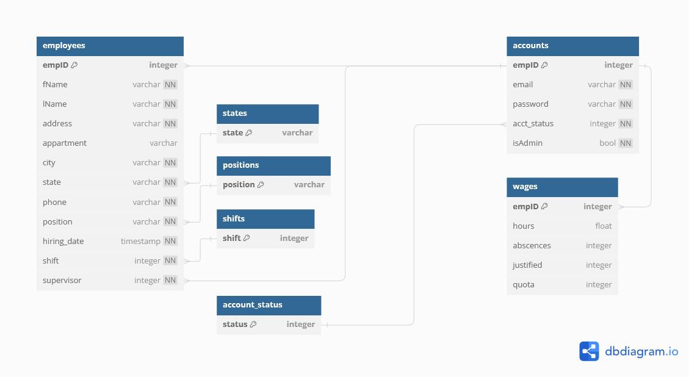

# Employee Management App

This Web App allows an employee working at a distribution center to edit their personal information as well as view their performance for the week and their pay, including performance, and attendance bonuses. An administrator can edit any employee's position and salary as well as delete their profile or create a new one.

## Prototype

Here is a quick prototype created with Figma: 
<a href='https://www.figma.com/proto/xyOPc04fT62nfdoE2BY4CR/App-Dashboard?node-id=0-1&t=jFOuYhtqTXEeHPR3-0'>Try the prototype here!</a> or 
<a href='https://www.figma.com/design/xyOPc04fT62nfdoE2BY4CR/App-Dashboard?node-id=0-1&t=jFOuYhtqTXEeHPR3-0'>View the design file here!  
</a> 

## SQL Database Diagram

Here is a draft diagram to gain a better understanding of the database required for this project: 

## MVC Class Diagram

A first draft Class Diagram for MVC development with PHP: 
 
### Model Classes 
 
### View Classes 
 
### Controller Classes 

